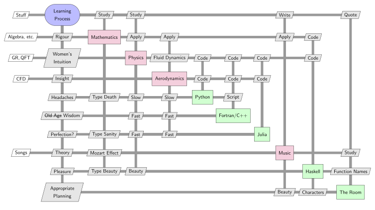

+++
date = "2016-12-26T01:45:08+05:30"
title = "About Me"
draft = false

+++

Hello! I'm Arjit Seth, a graduate student/researcher at Hong Kong University of Science and Technology.

My major interests (which inspired me to start this blog) are physics, mathematics, aerodynamics and music. I enjoy writing music, solving puzzles, chatting on `##math` and `##physics` on IRC, figuring out odd time signatures in music, reading manga/watching anime, attempting amateur design and a lot more!

My current exploits which I'm probably going to blog about:

* Learning Quantum Mechanics, Quantum Field Theory and General Relativity.
* Performing computational fluid dynamics analyses.
* Implementing flight dynamics control systems in multirotors and R/C aircraft.
* Learning Group Theory, Topology and Graph Theory.
* Programming physics and aerodynamics simulations in various languages.
* Developing music production skills for various genres.

A more comprehensive overview is available in my [CV](../Arjit Seth - Curriculum Vitae.pdf).

---
The following [eXtended Design Structure Matrix](https://github.com/mdolab/pyXDSM) outlines my learning process as an optimisation framework:

---

P.S. A big thanks to L. Aditya Srishti Chitturu for the logo!
